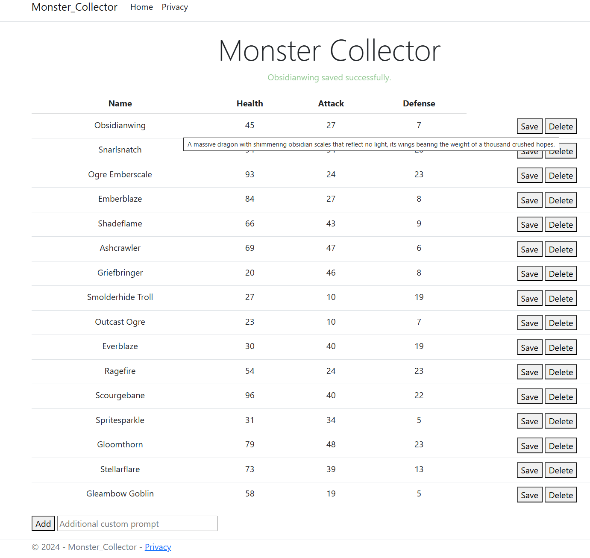

Monster Collector
=================

A simple VSCode C# .NET 8.0 web application using MVC, Razor, EntityFramework, and Sqlite to store a list of monsters. Monster names and descriptions are generated by an AI large language model (LLM) using [Cohere](https://cohere.com).

The table of monsters utilizes the `contenteditable` HTML attribute to inline editing of monster details. An ajax [call](Monster%20Collector/wwwroot/js/site.js) triggers the save to an API method on the backend.

Includes an audit log of all changes to records in the database.

## Quick Start

Install the required libraries in VSCode before running the project.

1. Open a Terminal in VSCode.
2. `dotnet add package Microsoft.EntityFrameworkCore.Design`
3. `dotnet add package Microsoft.EntityFrameworkCore.Sqlite`
4. `dotnet tool install --global dotnet-ef`
5. Create a file `Monster Collector/.env` with the line `CohereApiKey=<YOUR_API_KEY>`

*You can register a Cohere API key [here](https://dashboard.cohere.com/api-keys).*

## Generate Monsters in the Database

To re-generate the monsters in the database, use the following steps.

1. Delete the folder `Migrations`.
2. `dotnet ef migrations add InitialCreate`
3. `dotnet ef database update`

## API methods

#### GET /api/monster/{id}

Returns details for a specific monster by Id. The Id can be found in the table row `data-id` HTML attribute.

#### PUT /api/monster/{id}

Updates a specific monster by Id and payload.

## License

MIT

## Author

Kory Becker http://www.primaryobjects.com/kory-becker